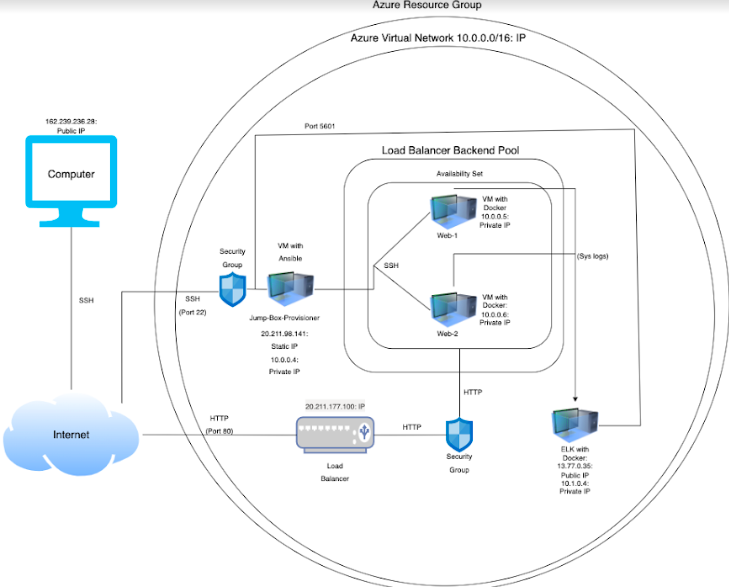
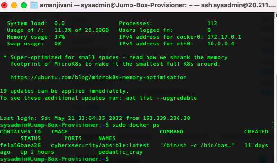

# GT_CS_Repo
### The repository contains all the class activities, homeworks, and projects completed during my time at The Georgia Institute of Technology Cyber and Network Security Bootcamp
_____________________________________________________________________________________________________

## Automated ELK Stack Deployment

The files in this repository were used to configure the network depicted below.

These files have been tested and used to generate a live ELK deployment on Azure. They can be used to either recreate the entire deployment pictured above. Alternatively, select portions of the filebeat-config.yml file may be used to install only certain pieces of it, such as Filebeat.

  - filebeat-playbook.yml

This document contains the following details:
- Description of the Topologu
- Access Policies
- ELK Configuration
  - Beats in Use
  - Machines Being Monitored
- How to Use the Ansible Build

### Description of the Topology

The main purpose of this network is to expose a load-balanced and monitored instance of DVWA, the D*mn Vulnerable Web Application.

Load balancing ensures that the application will be highly efficient, in addition to restricting access to the network.
- Load Balancers protect against DDoS (Distributed Denial-of-Service) attacks 
- The main advantage of using a JumpBox(SSH servers) is that it is the only way for access, since it is the only gateway for access to your infrastructure; This reduces the size of any potential attacks.

Integrating an ELK server allows users to easily monitor the vulnerable VMs for changes to the data and system logs.
- Filebeat watches for forwarding and centralizing log data. Filebeat monitors the log files and locations that you specify in which it collects log events and forwards them to indexing.
- Metricbeat records metrics and statistics and ships them to the output you specify. Metricbeat performs common tasks: Configuring Files and Loading Dashboards.

The configuration details of each machine may be found below.
_Note: Use the [Markdown Table Generator](http://www.tablesgenerator.com/markdown_tables) to add/remove values from the table_.

| Name        | Function | IP Address | Operating System |
|-------------|----------|------------|------------------|
| Jump Box    | Gateway  | 10.0.0.4   | Linux            |
| Web-1       | Docker   | 10.0.0.5   | Linux            |
| Web-2       | Docker   | 10.0.0.6   | Linux            |
| ELK-vMachine| Docker   | 10.1.0.4   | Linux            |

### Access Policies

The machines on the internal network are not exposed to the public Internet. 

Only the local machine can accept connections from the Internet. Access to this machine is only allowed from the following IP addresses:
- 162.239.236.28

Machines within the network can only be accessed by Jump-Box-Provisioner.
- ELK VM is only accessible through the Jump-Box-Provisioner. It can be accessed with ssh sysadmin@20.211.98.141

A summary of the access policies in place can be found in the table below.

| Name     | Publicly Accessible | Allowed IP Addresses |
|----------|---------------------|----------------------|
| Jump Box | Yes/No              | 10.0.0.1 10.0.0.2    |
|          |                     |                      |
|          |                     |                      |

### Elk Configuration

Ansible was used to automate configuration of the ELK machine. No configuration was performed manually, which is advantageous because...
- The main advantage of the Ansible is that it is very simple to use the playbook.The Ansible lets you model highly complex IT workflows. You can deploy the entire application environment no matter wherever.

The playbook implements the following tasks:
- Steps of the ELK installation play.
- In the YML script, the first step is to Install docker.io.
- After installing the docker.io package, we would install pip3.
- Continuing the steps, we would instal the docker python module, followed by the setting the virtual machine's memory to 262,144.
- Next, we download and launch the docker elk container with the image: seep/elk:761 and finally end the process with the service docker being rebooted to make sure its a success.

The following screenshot displays the result of running `docker ps` after successfully configuring the ELK instance.

### Target Machines & Beats
This ELK server is configured to monitor the following machines:
- Jump-Box-Provisioner: Public IP: 20.211.98.141
- The ELK server is downloaded and there for use over your Ansible Container. In my instance, it would be pedantic_cray.
- However the ELK server is setup to monitor the:
- Web-1(Private IP: 10.0.0.5) and Web-2(Private IP: 10.0.0.6)
- Public IP setup from the Load Balancer: 20.211.177.100

We have installed the following Beats on these machines:
- Filebeat
- Metricbeat

These Beats allow us to collect the following information from each machine:
- Filebeat collects Log Data: In my example, Filebeat updated all the cache data in the system.syslog, where I had on my Ansible container updated periodically. 
- Metricbeat collects Metric Data: In my example, Metricbeat can monitor the CPU usage on my Web-1 and Web-2 VM.

### Using the Playbook
In order to use the playbook, you will need to have an Ansible control node already configured. Assuming you have such a control node provisioned: 

SSH into the control node and follow the steps below:
- Copy the filebeat-config.yml file to ~/etc/ansible/.
- Update the filbert-config.yml file to include the IP address of your ELK-server, followed by the port number
- Create the (your playbook.yml) or download the file(filebeat-playbook.yml). 
- Run the playbook with ansible-playbook (your playbook.yml), if your installation works, you will see each command run changed and to verify: You can go on to Kibana and verify the information with the button.

- _Which file is the playbook? Where do you copy it?
- The file is called the filebeat-playbook.yml and you copy it to the /etc/ansible/ directory
- _Which file do you update to make Ansible run the playbook on a specific machine? 
- This would be the filebeat-config.yml and you specify it in front of hosts: with the IP address and port number of your Virtual Machine.
- _How do I specify which machine to install the ELK server on versus which to install Filebeat on?
- The ELK server would be installed on your main gateway, since that is where your Ansible container. The filebeat would be installed to monitor your Docker Virtual Machines. 
- _Website
- The URL, you navigate to see if the server is running: 13.77.0.35:5601/app/kibana

### The Scripts
- The Scripts are just a collection of bash scripts, I have created through my time at The Georgia Institute of Technology: Cyber and Network Security Bootcamp.

